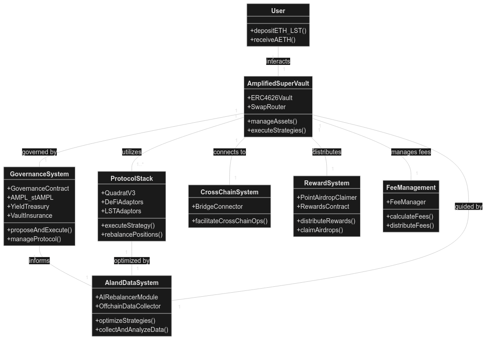
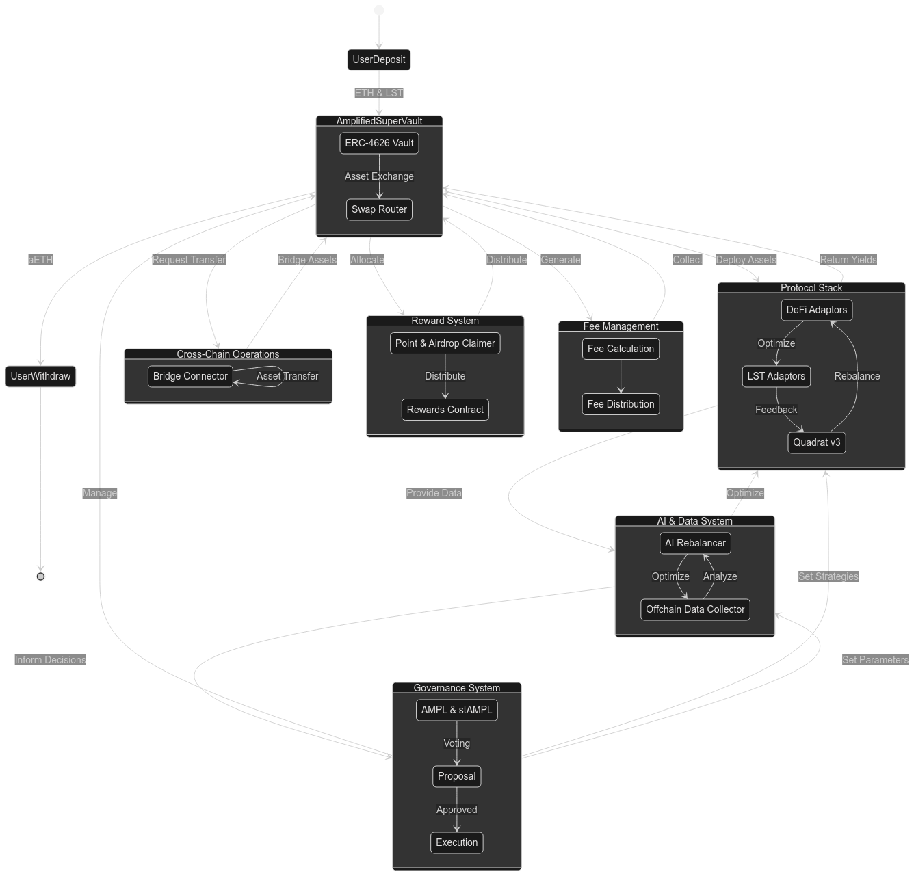
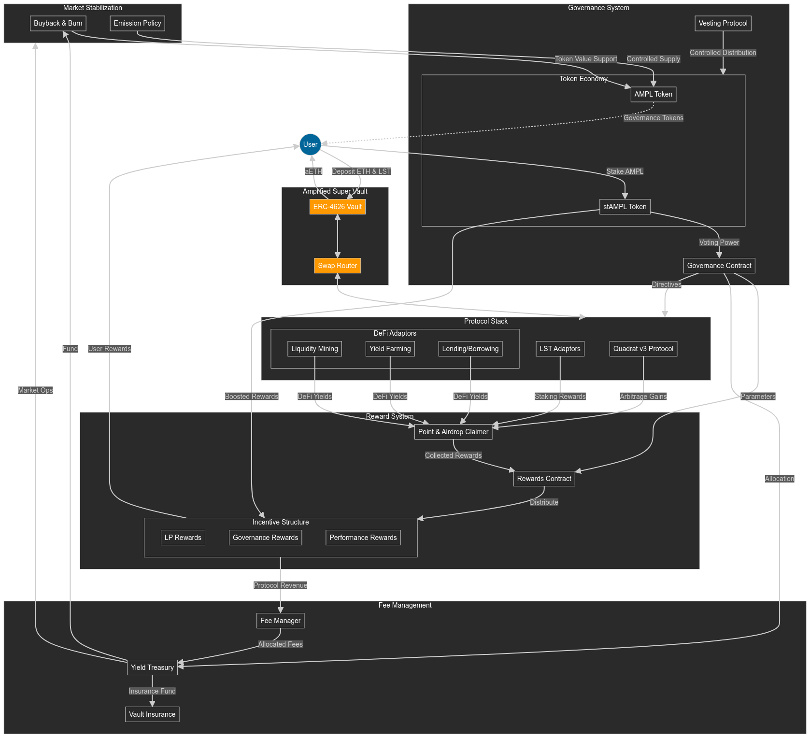

# Protocol Architecture

Amplified's core architecture leverages restaking-layers, such as Eigenlayer, to achieve its unique LSD re-staking and redistribution capabilities. Here's a breakdown of the key components and how they interact:

1. **User Interaction**

* Users deposit their LSDs (e.g., stETH, rETH) into Amplified's smart contracts.
* In return, they receive amplETH LP tokens representing their share in the Amplified staking pools and accruing value from re-staking rewards and generated DeFi yields.

2. **Restaking Layer Integration**

* Restaking layers enable Amplified to securely re-stake deposited Liquid Staking Derivatives (LSDs) across a network of validators without requiring permission from the original LSD providers.&#x20;
* This permissionless re-staking enhances yield potential while maintaining liquidity.&#x20;
* Additionally, the cross-chain compatibility of these layers allows Amplified to expand its validator network beyond Ethereum, tapping into broader DeFi ecosystems

3. **Multiprotocol LSD Diversification**

* Amplified integrates with multiple reputable LSD protocols like Lido, Rocket Pool, and others.
* This strategy distributes risk, ensuring the platform's resilience against issues that might affect a single LSD provider.
* The protocol's routing logic continuously monitors yields across different LSD integrations, optimizing allocation for the highest returns.

4. **Liquidity & Vault Management**

* Amplified employs active vault management strategies to optimize LSD liquidity and generate additional income:
  * **AMM Liquidity Provision:** Providing liquidity to Automated Market Makers (AMMs) to earn trading fees.
  * **Lending Protocols:** Supplying LSDs to lending protocols to earn interest.

5. **LSpool Optimization**

* **Dynamic Range Orders:** Amplified dynamically adjusts its re-staking strategies within LSD providers based on fee structures and available yield opportunities.
* **Rebalancing:** Re-distributes staked assets across LSDs to maintain optimal allocation patterns and maximize yield potential.
* **Fee Consolidation:** Amplified aggregates transactions and re-staking operations to reduce gas costs for users.

6. **Yield Boosting & Risk Mitigation**

* **Amplified Yield Strategies:** Re-staked LSDs are deployed into carefully selected DeFi protocols across different chains (accessible through Eigenlayer) for further yield generation.
* **Risk Mitigation:** Amplified implements measures to protect users' assets:
  * **Validator Diversification:** Distributes deposits across a wide range of reliable validators.
  * **Insurance Coverage:** May explore insurance options to mitigate risks associated with smart contract exploits or slashing events.


**Key Takeaways:**

* Amplified's Eigenlayer-powered architecture enables a unique form of LSD re-staking for enhanced decentralization and yield.
* Diversification and active management strategies promote security and yield maximization.
* Amplified aims to be a user-friendly platform with continuous innovation in LSD re-staking and yield generation.


## Protocol Architecture (including EIP-2535 and ERC-4626 standards)

<figure><figcaption></figcaption></figure>

This diagram illustrates the comprehensive architecture of the Amplified protocol, incorporating the EIP-2535 Diamond standard, ERC-4626 Tokenized Vault standard, and the adaptor system. Here's a breakdown of the key components and their relationships:

1. AmplifiedDiamond:
   * Central contract implementing both EIP-2535 and ERC-4626 standards.
   * Provides core vault functionalities (deposit, withdraw, asset conversion).
2. Facets:
   * DepositWithdrawalFacet: Handles user deposits and withdrawals.
   * StrategyManagementFacet: Manages strategy execution and rebalancing.
   * AdaptorManagementFacet: Handles adaptor configuration and management.
   * SwapFacet: Provides token swap functionality.
   * GovernanceFacet: Manages protocol upgrades and governance actions.
3. Adaptors:
   * BaseAdaptor: Abstract base class for all adaptor contracts.
   * Specific Adaptors (AaveAdaptor, PendleAdaptor): Implement protocol-specific logic.
   * SwapAdaptor: Handles token swaps through external DEXes.
4. Convertors:
   * AaveConvertor and PendleConvertor: Handle protocol-specific data encoding.
5. Storage and Registry:
   * DiamondStorage: Manages the protocol's state, including adaptor addresses and strategy data.
   * AdaptorRegistry: Keeps track of registered adaptors.
6. External Interactions:
   * ExternalDEX: Represents external decentralized exchanges for token swaps.
7. User Interactions:
   * User: Represents end-users interacting with the protocol.
   * Governance: Represents governance actions for protocol management.

Key Business Logic and Relationships:

* The AmplifiedDiamond contract serves as the central point of interaction, implementing both EIP-2535 and ERC-4626 standards.
* Facets provide modular functionality, allowing for easy upgrades and maintenance.
* The adaptor system (BaseAdaptor and its derivatives) enables integration with various DeFi protocols.
* Convertors handle protocol-specific data encoding, abstracting complexity from the main contracts.
* The SwapFacet and SwapAdaptor enable token swaps, crucial for strategy execution and rebalancing.
* DiamondStorage provides a unified storage solution for the entire protocol.
* The AdaptorRegistry manages the registration and retrieval of adaptors.
* Governance interactions are handled through the GovernanceFacet, allowing for protocol upgrades and strategy adjustments.
* Users interact with the AmplifiedDiamond contract for core vault operations (deposit, withdraw).

## Amplified Protocol: Component Breakdown and Explanation

<figure><figcaption>
Amplified protocol components
</figcaption></figure>

### User Interaction

Users interact with the Amplified protocol by depositing ETH and Liquid Staking Tokens (LSTs) into the Amplified Super Vault. In return, they receive amplETH tokens representing their share of the total protocol stake.

### Amplified Super Vault

The core of the protocol, consisting of several key components:

1. **ERC-4626 Vault**: A standard-compliant vault that manages user deposits and interacts with various protocol components.
2. **Governance Contract**: Oversees the entire Amplified ecosystem, similar to Aave Governance v3, including:
   * LLT & weLoveLLT Token: Core governance tokens
   * LLT Treasury: Holds protocol-owned tokens
   * weLoveLLT Staking: Allows users to stake LLT for voting power
   * LLT Vesting Protocol: Manages token distribution
   * Yield Treasury: Collects and manages protocol fees
   * Vault Insurance: Provides coverage using 10% of treasury funds
   * TimeLock Contract: Manages proposal execution
   * Strategy Executor: Implements rebalancing actions
   * Rewards and Incentive Contract: Manages staker and LP incentives
3. **Swap Router & AMM Adaptors**: Facilitates token exchanges and includes:
   * Price Oracle Connectors: Ensure accurate pricing
   * Routing Pool Aggregator: Optimizes token swaps across various DEXes
4. **Amplified ALM v3 Protocol**: Manages structured positions in v3 AMM protocols:
   * ALM Protocol: Holds and manages positions
   * AI ALM Rebalancers: Executes position rebalancing
5. **DeFi Adaptors**: Interfaces with various DeFi protocols for yield optimization
6. **LST Adaptors and Restaking Protocol**: Manages positions in liquid staking protocols
7. **Bridge Connector**: Enables cross-chain position management
8. **Point & Airdrop Claimer**: Captures additional value from protocol interactions
9. **Fee Manager**: Calculates and distributes protocol fees

### Offchain Components

1. **AI Rebalancer Offchain Module**: Calculates optimal strategies based on collected data
2. **Offchain Data Collector**: Aggregates data from various protocol components

This structure allows Amplified to efficiently manage user funds across multiple DeFi protocols and chains, optimizing yields while maintaining a robust governance and security framework.

## Amplified protocol user flow, states and processes

<figure><figcaption>
The flow of assets and information through the system, as well as the different states and processes within the protocol.
</figcaption></figure>

* **User Flow**: The diagram starts and ends with user interactions (deposit and withdraw), showing the full cycle of asset movement.
* **Amplified Super Vault**: Represented as a main state containing the ERC-4626 Vault and Swap Router, showing internal asset exchanges.
* **Governance System**: Displayed as a cycle of token holding, proposal, and execution, emphasizing the democratic nature of protocol management.
* **Protocol Stack**: Shows the interaction between Amplified ALM v3, DeFi Adaptors, and LST Adaptors in a continuous optimization loop.
* **Cross-Chain Operations**: Represented as a self-contained state with bidirectional asset transfers.
* **Reward System**: Illustrates the flow from claiming to distribution of rewards.
* **Fee Management**: Shows the process of fee calculation and distribution.
* **AI & Data System**: Represents the continuous loop of data collection, analysis, and strategy optimization.
* **Inter-component Relationships**: Arrows between major components show the flow of assets, information, and control across the entire protocol.

## Amplified Protocol: Economic Value Flow

<figure><figcaption></figcaption></figure>

The economic schema of the Amplified protocol, focusing on LLT token value creation and yield farming strategies:

1. **Amplified Super Vault (ASV)**:
   * Remains the core entry point for user funds.
2. **Protocol Stack (PS)**:
   * Amplified ALM v3 Protocol: Focuses on advanced trading and positioning strategies.
   * DeFi Adaptors: Now broken down into specific strategies:
     * Liquidity Mining: Provides liquidity to DEXes for fee generation.
     * Yield Farming: Actively seeks the best yield opportunities across DeFi.
     * Lending/Borrowing: Utilizes lending protocols for additional yield.
   * LST Adaptors: Manages liquid staking tokens for staking rewards.
3. **Reward System (RS)**:
   * Point & Airdrop Claimer: Collects various rewards from protocol interactions.
   * Rewards Contract: Distributes rewards through an enhanced Incentive Structure:
     * LP Rewards: For liquidity providers.
     * Governance Rewards: For active participation in governance.
     * Performance Rewards: Based on protocol's overall performance.
4. **Fee Management (FM)**:
   * Now includes funding for Market Stabilization operations.
5. **Governance System (GS)**:
   * Expanded Token Economy:
     * LLT Token: Core governance token.
     * weLoveLLT Token: Staked LLT with enhanced benefits.
   * Vesting Protocol: Ensures controlled token distribution.
6. **Market Stabilization (MS)**:
   * Buyback & Burn: Supports LLT token value.
   * Emission Policy: Controls token supply based on protocol performance.

**Value Creation for LLT**:

1. Staking Mechanism: Users can stake LLT for veLLT, providing governance rights and boosted rewards.
2. Buyback & Burn: Utilizes protocol revenues to purchase and burn LLT, potentially increasing its scarcity and value.
3. Governance Participation: Active governance participants receive additional rewards, incentivizing engagement.
4. Performance-Linked Value: As the protocol performs better, LLT holders benefit through increased rewards and potential token value appreciation.

**Yield Farming Strategies**:

1. Diversified Approach: The DeFi Adaptors now explicitly cover various strategies (Liquidity Mining, Yield Farming, Lending/Borrowing) to maximize yields.
2. Cross-Protocol Optimization: The Amplified ALM v3 Protocol can optimize positions across these strategies.
3. LST Integration: LST Adaptors allow for additional yield from staking rewards while maintaining liquidity.
4. Dynamic Allocation: The Governance System can adjust strategy allocations based on market conditions and performance.
5. Compounding Effects: Rewards from all strategies are collected and can be reinvested, creating a compounding effect.
