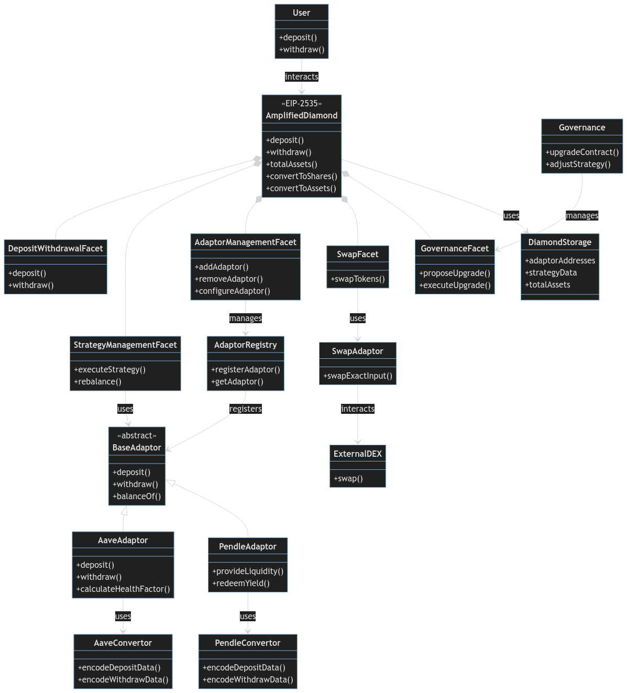

# ERC-4626 Tokenization

### Core Technical Architecture

### **ERC-4626 Vault Implementation**

The Amplified Super Vault implements the ERC-4626 tokenized vault standard, establishing a sophisticated framework for yield-bearing tokens that optimizes both capital efficiency and user accessibility. This implementation represents a significant advancement in DeFi vault technology, providing institutional-grade asset handling capabilities while maintaining maximum security and composability.

<figure><figcaption></figcaption></figure>

*   Vault Standardization:&#x20;

    * Standardized deposit/withdrawal interface enabling seamless integration with any ERC-4626 compatible protocol
    * High-precision share calculation system using 18 decimal places for maximum accuracy in yield distribution
    * Real-time share price updates that automatically reflect yields, losses, and rebase events
    * Advanced accounting system tracking both underlying assets and share tokens independently
    * Gas-optimized operations through batched processing and efficient storage patterns
    * Multi-layered emergency systems including circuit breakers and controlled shutdown mechanisms

    This standardization enables sophisticated asset management while maintaining perfect accounting accuracy and maximum capital efficiency. For investors, this means transparent, accurate tracking of positions and yields while minimizing transaction costs.
*   Asset Management Framework:&#x20;

    * Automated yield distribution system that compounds returns directly into share price
    * Dynamic share price calculation incorporating multiple yield sources and fee structures
    * Efficient capital utilization through cross-protocol deployment and yield optimization
    * Risk-adjusted position management using sophisticated mathematical models
    * Real-time monitoring and adjustment of asset allocations
    * Advanced slippage protection during large deposits or withdrawals

    This framework enables institutional-grade asset management while maintaining high capital efficiency and risk control. Developers can build on top of these standardized interfaces, while investors benefit from sophisticated yield optimization with minimal friction.

<figure><figcaption></figcaption></figure>
