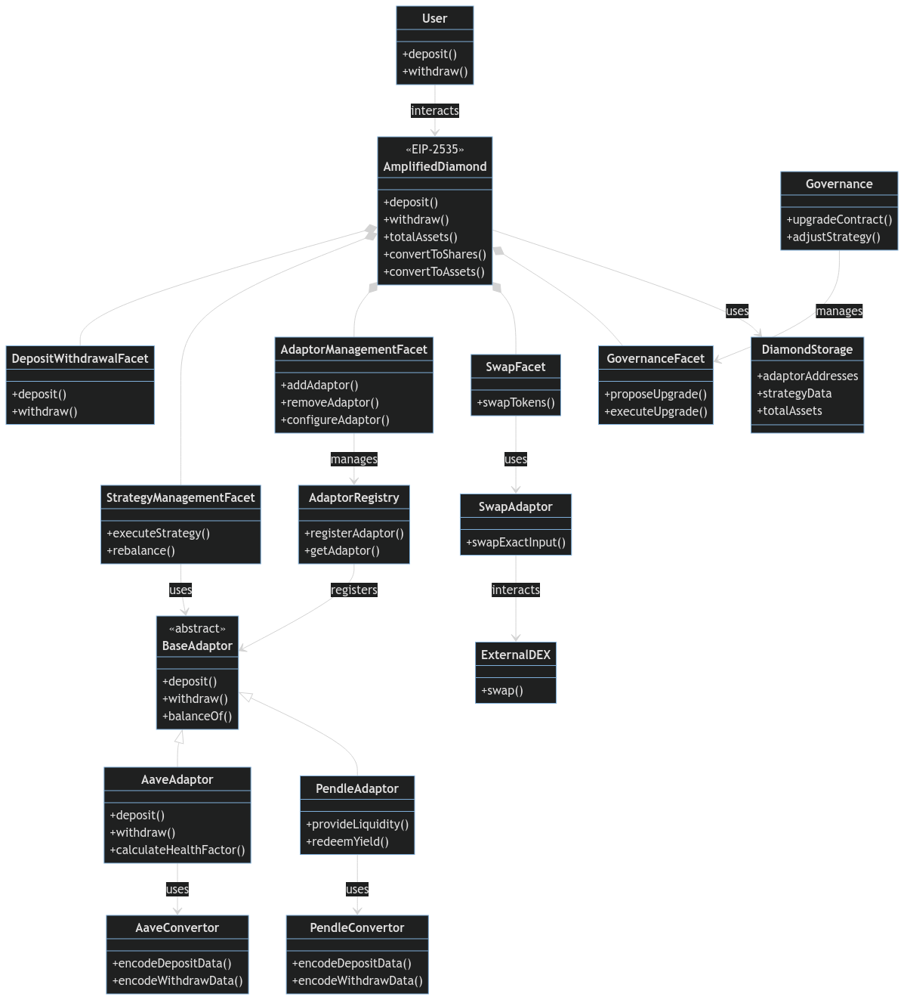

# Protocol Architecture

Amplified's core architecture leverages Eigenlayer to achieve its unique LSD re-staking and redistribution capabilities. Here's a breakdown of the key components and how they interact:

**1. User Interaction**

* Users deposit their LSDs (e.g., stETH, rETH) into Amplified's smart contracts.
* In return, they receive aETH LP tokens representing their share in the Amplified staking pools and accruing value from re-staking rewards and generated DeFi yields.

**2. Eigenlayer Integration**

* Eigenlayer middleware enables Amplified to securely re-stake the deposited LSDs across a network of Eigenlayer validators.
* This process is permissionless, meaning Amplified doesn't need authorization from the original LSD providers.
* Eigenlayer's cross-chain compatibility allows Amplified to potentially expand its validator network beyond Ethereum in the future.

**3. Multiprotocol LSD Diversification**

* Amplified integrates with multiple reputable LSD protocols like Lido, Rocket Pool, and others.
* This strategy distributes risk, ensuring the platform's resilience against issues that might affect a single LSD provider.
* The protocol's routing logic continuously monitors yields across different LSD integrations, optimizing allocation for the highest returns.

**4. Liquidity & Vault Management**

* Amplified employs active vault management strategies to optimize LSD liquidity and generate additional income:
  * **AMM Liquidity Provision:** Providing liquidity to Automated Market Makers (AMMs) to earn trading fees.
  * **Lending Protocols:** Supplying LSDs to lending protocols to earn interest.

**5. LSpool Optimization**

* **Dynamic Range Orders:** Amplified dynamically adjusts its re-staking strategies within LSD providers based on fee structures and available yield opportunities.
* **Rebalancing:** Re-distributes staked assets across LSDs to maintain optimal allocation patterns and maximize yield potential.
* **Fee Consolidation:** Amplified aggregates transactions and re-staking operations to reduce gas costs for users.

**6. Yield Boosting & Risk Mitigation**

* **Amplified Yield Strategies:** Re-staked LSDs are deployed into carefully selected DeFi protocols across different chains (accessible through Eigenlayer) for further yield generation.
* **Risk Mitigation:** Amplified implements measures to protect users' assets:
  * **Validator Diversification:** Distributes deposits across a wide range of reliable validators.
  * **Insurance Coverage:** May explore insurance options to mitigate risks associated with smart contract exploits or slashing events.


**Key Takeaways:**

* Amplified's Eigenlayer-powered architecture enables a unique form of LSD re-staking for enhanced decentralization and yield.
* Diversification and active management strategies promote security and yield maximization.
* Amplified aims to be a user-friendly platform with continuous innovation in LSD re-staking and yield generation.


## Protocol Architecture (including EIP-2535 and ERC-4626 standards)

<figure><figcaption></figcaption></figure>

This diagram illustrates the comprehensive architecture of the Amplified protocol, incorporating the EIP-2535 Diamond standard, ERC-4626 Tokenized Vault standard, and the adaptor system. Here's a breakdown of the key components and their relationships:

1. AmplifiedDiamond:
   * Central contract implementing both EIP-2535 and ERC-4626 standards.
   * Provides core vault functionalities (deposit, withdraw, asset conversion).
2. Facets:
   * DepositWithdrawalFacet: Handles user deposits and withdrawals.
   * StrategyManagementFacet: Manages strategy execution and rebalancing.
   * AdaptorManagementFacet: Handles adaptor configuration and management.
   * SwapFacet: Provides token swap functionality.
   * GovernanceFacet: Manages protocol upgrades and governance actions.
3. Adaptors:
   * BaseAdaptor: Abstract base class for all adaptor contracts.
   * Specific Adaptors (AaveAdaptor, PendleAdaptor): Implement protocol-specific logic.
   * SwapAdaptor: Handles token swaps through external DEXes.
4. Convertors:
   * AaveConvertor and PendleConvertor: Handle protocol-specific data encoding.
5. Storage and Registry:
   * DiamondStorage: Manages the protocol's state, including adaptor addresses and strategy data.
   * AdaptorRegistry: Keeps track of registered adaptors.
6. External Interactions:
   * ExternalDEX: Represents external decentralized exchanges for token swaps.
7. User Interactions:
   * User: Represents end-users interacting with the protocol.
   * Governance: Represents governance actions for protocol management.

Key Business Logic and Relationships:

* The AmplifiedDiamond contract serves as the central point of interaction, implementing both EIP-2535 and ERC-4626 standards.
* Facets provide modular functionality, allowing for easy upgrades and maintenance.
* The adaptor system (BaseAdaptor and its derivatives) enables integration with various DeFi protocols.
* Convertors handle protocol-specific data encoding, abstracting complexity from the main contracts.
* The SwapFacet and SwapAdaptor enable token swaps, crucial for strategy execution and rebalancing.
* DiamondStorage provides a unified storage solution for the entire protocol.
* The AdaptorRegistry manages the registration and retrieval of adaptors.
* Governance interactions are handled through the GovernanceFacet, allowing for protocol upgrades and strategy adjustments.
* Users interact with the AmplifiedDiamond contract for core vault operations (deposit, withdraw).
