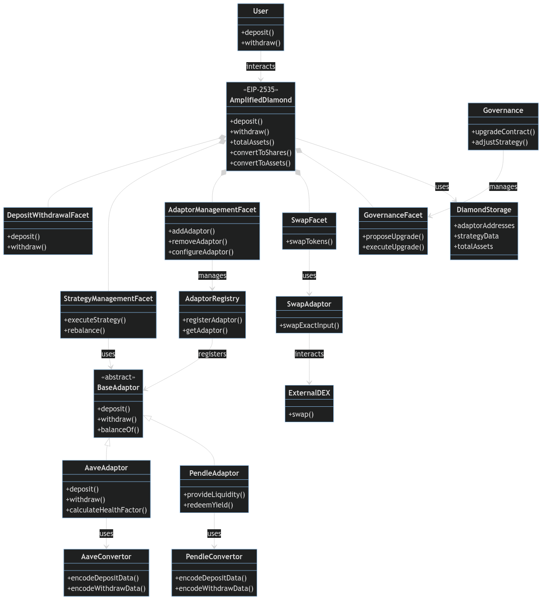

# How to Participate?

## **Preparation**

1. **Find a Referral Code:**
   * Search our Discord server or Twitter for an invite or referral code shared by existing community members.
2. **Visit Amplified App:**
   * Go to [amplified.fi](https://amplified.fi) and connect your Web3 wallet.
3. **Apply Referral Code:**
   * Enter the referral code you found to join the network and start earning points.

<figure><figcaption></figcaption></figure>

## **Engage and Earn**

1. **Validate Your Account:**
   * **Connect Twitter:** Link your Twitter account to validate your profile.
   * **Retweet:** Share our latest tweet and confirm it in your dashboard.
   * **Connect Discord:** Link your Discord account to validate your presence in our community.
2. **Accept Terms and Conditions:**
   * Sign the Terms and Conditions message using your Web3 wallet to proceed.
3. **Deposit ETH:**
   * Make an ETH deposit into the Amplified vault to start earning high APY and accumulate points.
   * Remember, higher deposits place you in higher point booster tiers.
4. **Get Your Referral Codes:**
   * Receive up to **3 unique referral codes daily** to share with friends and followers.
   * Share these codes on social media platforms like Twitter and Telegram to build your squad.
5. **Stay Active:**
   * Participate in community events, quests, and campaigns to earn bonus points.
   * Provide feedback and suggestions to help us improve the platform.

<figure><figcaption></figcaption></figure>

## **Enjoy the Benefits**

* **High ETH Yield:** Earn competitive returns on your deposits through automated strategies.
* **Accumulating Points:** Watch your points grow as you and your squad stay active.
* **Community Growth:** Be part of a thriving ecosystem that values your contribution.

## Multi-Level Referral System Explained

Our referral system is designed to amplify your earning potential by rewarding you for both direct and indirect referrals.

#### **Levels of Referrals**

* **Level 1 (Direct Referrals):**
  * Earn **20%** of the points from your direct referrals' activities.
* **Level 2 (Indirect Referrals):**
  * Earn **10%** of the points from the referrals made by your direct referrals.

#### **How Points Are Calculated**

* **Your Activities:** You earn points based on your own ETH deposits and participation.
* **Referrals' Activities:** You earn a percentage of the points that your referrals accumulate.

**Example Calculation:**

* **You Deposit:** 5 ETH (earning 2 points per hour).
* **Level 1 Referral (Alice):**
  * Deposits 10 ETH (earning 4 points per hour).
  * You earn 20% of her points: 0.8 points per hour.
* **Level 2 Referral (Bob):**
  * Alice refers Bob, who deposits 1 ETH (earning 1 point per hour).
  * You earn 10% of his points: 0.1 points per hour.
* **Total Points Earned per Hour:**
  * Your points: 2
  * From Alice: 0.8
  * From Bob: 0.1
  * **Total:** 2.9 points per hour

<figure><figcaption></figcaption></figure>

## ETH Point Booster Detailed

The more you deposit, the more points you earn per hour. This system incentivizes larger deposits by offering exponential point rewards.

#### **Point Booster Tiers**

| **Tier**   | **ETH Deposit Range** | **Points per Hour** |
| ---------- | --------------------- | ------------------- |
| **Tier 1** | 0 - 1 ETH             | 1 point             |
| **Tier 2** | >1 - 10 ETH           | 2 points            |
| **Tier 3** | >10 - 100 ETH         | 4 points            |
| **Tier 4** | >100 - 500 ETH        | 8 points            |
| **Tier 5** | >500 ETH              | 16 points           |

**Strategize Your Deposits:**

* **Maximize Points:** Aim to deposit amounts that place you in higher tiers.
* **Encourage Referrals:** Motivate your squad to increase their deposits for mutual benefits.

**Example Scenario:**

* **Depositing 50 ETH:**
  * You enter Tier 3 and earn 4 points per hour.
* **Upgrading to 150 ETH:**
  * You move to Tier 4 and start earning 8 points per hour, doubling your previous earnings.

## Why Participate Now?

* **Early Adopter Advantages:** Secure a top position on the leaderboard before the masses join.
* **LLT Airdrop Eligibility:** Higher points increase your share in the upcoming LLT token airdrop.
* **Community Influence:** Establish yourself as a leader in the Amplified community.

> The Amplified Protocol Point System offers an exciting opportunity to maximize your rewards while contributing to the growth of a revolutionary DeFi platform. By actively participating, referring others, and engaging with the community, you not only enhance your own earnings but also help shape the future of decentralized finance.

**Join us today and amplify your DeFi experience!**
